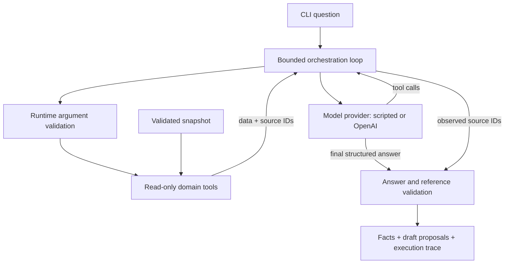

# Architecture and trade-offs

## Request flow

The model selects read operations and writes a response. Domain code owns membership filters, date boundaries, and snapshot integrity. There is no execution path from a draft to an external action.

## A small provider boundary

`ModelProvider.respond()` receives instructions, conversation items, and tool definitions. A provider returns Responses-shaped output items. The orchestrator owns the tool loop, handles invalid tool arguments, tracks successful source IDs, and validates the final answer.

The demo provider is deliberately scripted. It requests the expiring-memberships tool once, then constructs an answer from the result. This makes the software path reproducible without pretending to measure a language model.

The OpenAI adapter uses Node's built-in `fetch`, a 30-second timeout per request, a strict answer schema, and no automatic retries. Avoiding retries keeps API activity predictable; callers can explicitly retry a failed question. The default orchestrator allows at most four provider calls and eight tool calls. These are call-count limits, not a monetary budget or a cap on total input tokens.

With `store: false`, continuation supplies the previous output items and the tool results. Reasoning items are preserved, including encrypted reasoning content when returned by the API. Raw HTTP failure bodies and network exception details are omitted from user-facing errors.

## Time is part of the data contract

The dataset has an explicit `asOf` date. A seven-day lookahead includes dates from `asOf` through `asOf + 7`, inclusive. Consequently, `withinDays: 0` means the entire snapshot date. This is a calendar-day window, not a rolling 168-hour interval.

Member package dates use `YYYY-MM-DD`; lesson timestamps must be valid UTC ISO timestamps ending in `Z`. Upcoming lessons start at midnight on `asOf` and end before midnight following the final date. Cancelled and completed lessons are excluded from upcoming results. Member context intentionally includes all lesson statuses and historical records.

Validation rejects duplicate IDs, invalid dates, negative lesson balances, unknown fields, and lesson references to missing members. Tools keep an isolated snapshot and return copied data so callers cannot mutate the underlying state.

## Evidence is traceability, not a truth oracle

Every fact must have at least one reference drawn from a successful tool result. Each draft must also cite `member:<its memberId>`. An unknown source ID is rejected, even if its format looks valid.

This checks reference existence and observation. It does not establish semantic entailment. A model could cite a real member and misstate a date, write an inaccurate summary, or propose an inappropriate follow-up. The current validator cannot rule those out. Evaluation and human review address a different layer from schema validation.

Names and tool outputs are designated as untrusted data in the model instructions. This is a mitigation, not a proven prompt-injection defense. The stronger present boundary is structural: the tool registry exposes no write operations, message sender, arbitrary SQL, shell, or network access.

## Why no retrieval database or agent framework yet?

The initial questions have structured answers in a small member/lesson snapshot. Explicit tools make the business rules and source records inspectable. An embedding index would add little to those queries. A framework is unnecessary for a single bounded tool loop and would hide some of the behavior this repository aims to show.

Node 24 runs the project's erasable TypeScript directly. The application and tests use built-in modules, so the first demo requires no dependency installation. TypeScript stripping is not type checking; the initial source was separately checked using TypeScript in strict mode, while the committed CI currently runs behavioral tests and scenarios.

## What changes before real operational use?

1. Add an adapter that enforces tenant and user permissions before reading records. Model instructions are not authorization.
2. Limit dataset size, returned rows, and context payload; add pagination where needed.
3. Evaluate real model runs against expected IDs and reviewed claims, recording exact model and usage.
4. Add retention controls and appropriate handling for any real personal data sent to a provider.
5. If writes are introduced, separate proposals from execution and require review, idempotency, and an audit record at that boundary.

These are future work, not implemented capabilities.
